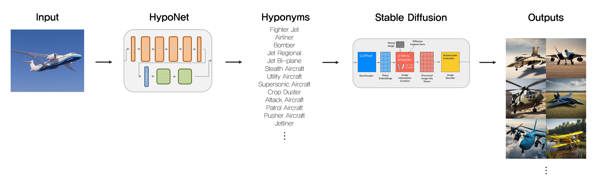

# HypoNet 🗂️

 >  **Image Dataset Generation Using Diffusion Model**\
 디퓨전 모델을 활용한 이미지 데이터셋 생성


<br />

- **```HypoNet```** 을 사용하면 **```합성 이미지만으로도 AI 모델 학습이 가능함```**
- 관련 연구 중 **```가장 높은 지표 점수 달성```** (Accuracy, FID, IS)

<br />
<br />

## 설명
> 최근 AI 발전의 고도화와 함께 **학습 데이터의 부족** 문제가 대두되고 있다.   
**학습 데이터를 생성**하여 모델을 학습시키려는 연구는 지속되었지만 모두 실패하였다.   
**HypoNet**은 기존 연구의 문제점들을 해결하였고,   
실제 이미지 없이 생성된 **합성 이미지 만으로도 AI 모델 학습이 가능**해졌으며   
심지어, 실제 이미지로만 학습된 모델보다 **더 높은 정확도**를 달성하였다.

<br />

| **사용언어** | **하드웨어** | **제작년도** |
|:------------:|:------------:|:------------:|
| Python            | A100, H100, RTX4090*4    | 2023         |


<br />
<br />


1.  ```HypoNet```의 입력은 ```한 장의 이미지```이다.
2.  ```HypoNet```의 출력은 ```다양한 Hyponym(하위 카테고리)```이다.
3.  Diffusion Model의 앞단에 Input으로 적용되며, 결론적으로 ```다양한 이미지를 생성```하게 된다.

<br />
<br />


- ```HypoNet 적용 전``` 한 가지 종의 고양이, 정면 이미지만 출력 됨
- ```HypoNet 적용 후``` **여러 종**의 고양이, **다양한 각도**의 이미지가 출력 됨


<br />
<br />

### HypoNet Demo

- 원하는 갯수의 Hyponym이 출력된다.
- 최대 개수는 WordNet(사전)에 등록된 단어 수이다.

<br />

### HypoNet + SD 1.5 Demo

- Hyponym과 결합된 SD는 다양한 이미지를 생성한다.

<br />

### Hyponet 구조


<br />
<br />

## 검증 방법

1. SD(1.4, 1.5, XL)을 베이스로 다양한 기법을 적용하여 데이터셋을 생성
2. 어떤 기법을 적용했을 때 가장 지표 점수가 높은지 비교 (Accuracy, FID, IS)

<br />

## 검증 결과

- **<span style="color:lightgreen"> 초록색 </span>**: 실제이미지(CIFAR-10 Train)데이터로 학습시 이미지 분류 정확도
- **<span style="color:skyblue"> 파란색 </span>**: 각 기법 적용 후 생성된 데이터로 학습시 이미지 분류 정확도
- **<span style="color:red"> 빨간색 </span>**: HypoNet 적용 후 생성된 데이터로 학습시 이미지 분류 정확도

<br />
<br />

## 결론

 **```HypoNet```** 은 모든 기법들에 비해 **```더 높은 정확도```** 를 달성하였으며   
특히 1.5모델 기반 데이터는 **```실제 이미지로 학습한 모델보다 정확도가 높았다.```**